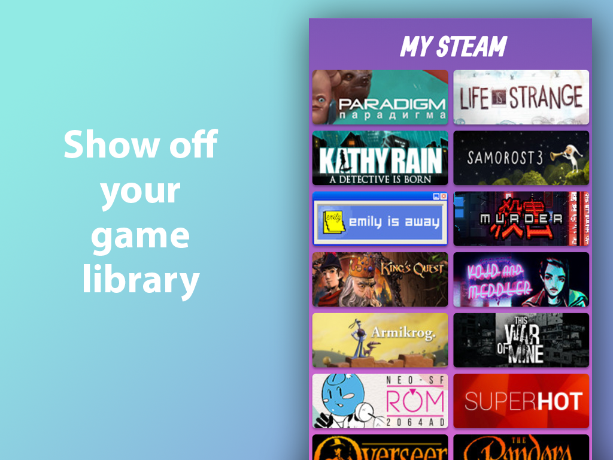

# My Steam Games - Twitch Extension



**Welcome My Steam Games extension for Twitch**

This extension is split into three parts:

- Twitch panel extension (this repo)
- My Steam Games server
- Find My Steam ID helper

## Development Setup

### Prerequisites

- Install [Node.js] which includes [Node Package Manager][npm]

Install all dependencies:
```commandline
npm install -D
```

Start local angular server:
```commandline
npm run start
```

You now have a local server running at https://localhost:4200

When opening this url with your browser, you will get a notification that this ssl connection cannot be verified. You will need to type 'thisisunsafe' once, or click "I understand". From now on, you should be able to use the local https server without problems.

To work on design, open https://localhost:4200/?mode=preview

## Want to Help?

Want to report a bug, submit ideas, contribute code, or improve documentation? ***Amazing!*** Please submit a new [Issue](https://github.com/hypestreaming/my-steam-games-ext/issues) on github.

## Community

Join the conversation and help the community.

- [Discord][discord]

[changelog]: CHANGELOG.md
[discord]: https://discord.gg/2d6UDXW
[node.js]: https://nodejs.org/


